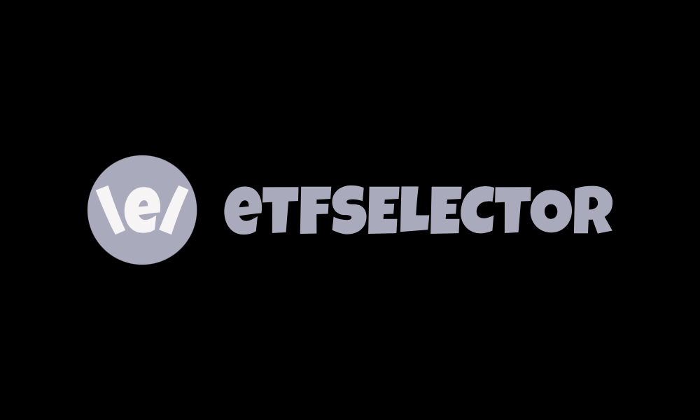
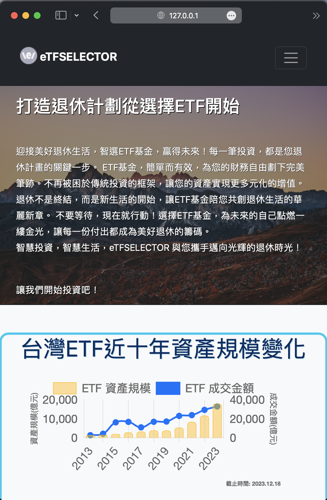
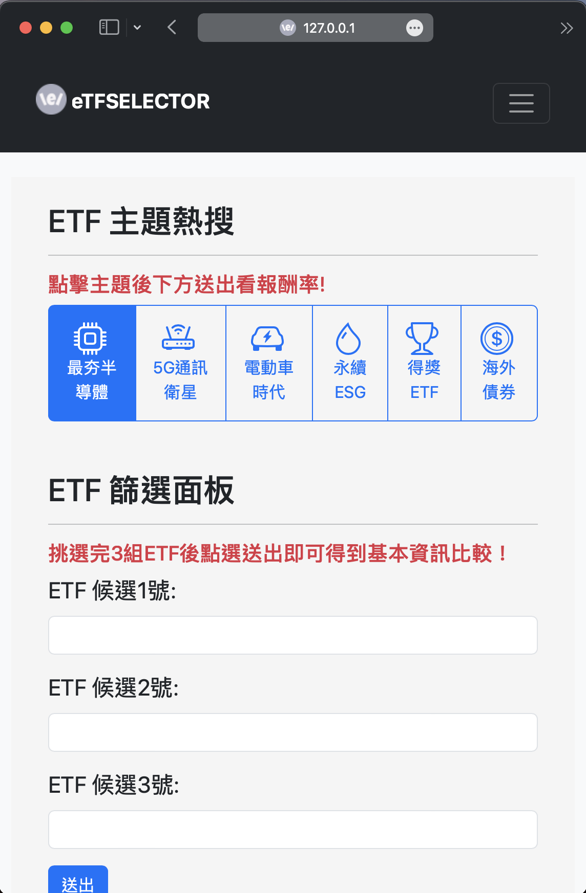
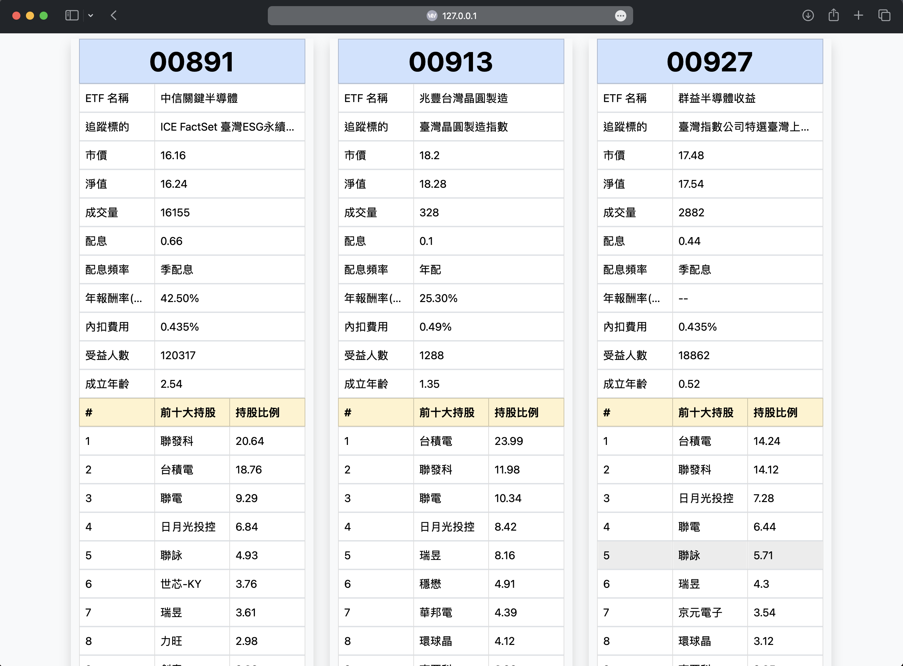

# ETF Comparison Web Application (eTFSELECTOR)

## Overview

This web application provides a user-friendly interface for comparing the long-term return rates of various Exchange-Traded Funds (ETFs). Built using Flask and MongoDB, it offers a seamless experience for users to explore and analyze different ETFs effortlessly. 

## Features

1. Flask Based Web with MongoDB Integration: 
  - Utilizes the Flask framework for a robust and scalable web application.
  - Backed by MongoDB, ensuring efficient and flexible data storage.

2. Long-term Return rate chart of ETFs: 
  - Dynamically generates a clear chart for easy visualization of the long-term return rates.
  - Enhances user understanding and decision-making by providing a graphical representation of comparative performance.

3. Interactive Comparison: 
  - Users can easily navigate through the web application.
  - Clicking on images from the homepage redirects to a the other page which can easily read the difference between ETFs.

## Usage

1. Homepage:
  - Navigate to the homepage to view a list of available ETFs.
  - Click on an ETF image to access the detailed comparison page.  

2. Info Comparison Page:
  - Explore and analyze long-term return rates with preloaded parameters.
  - includes fee/dividends/benefit number/founding years  

3. Long-term Return Rate Chart
  - Visualize the return from beginning that easily compare the growth between different ETFs.  

